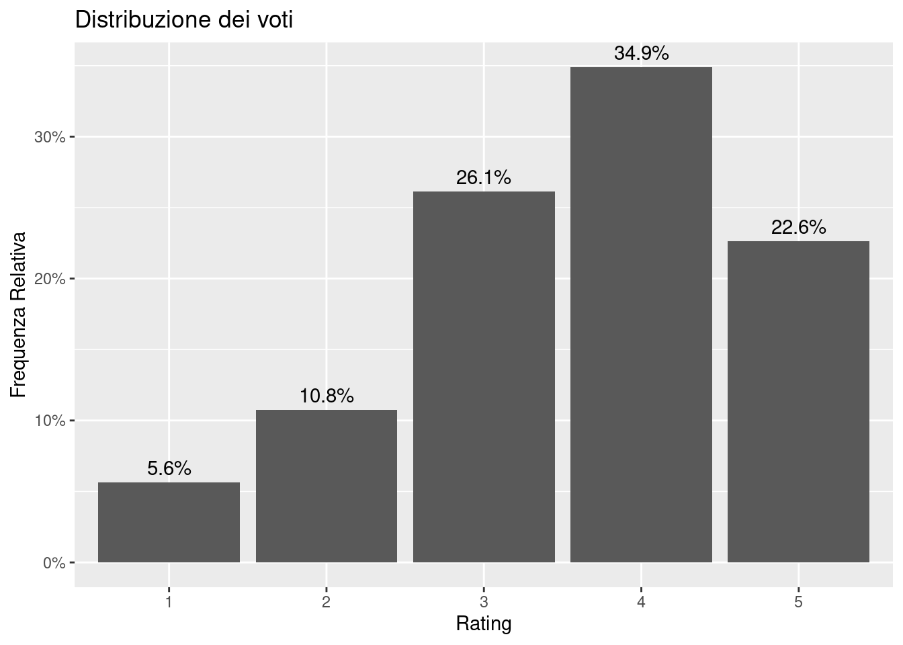
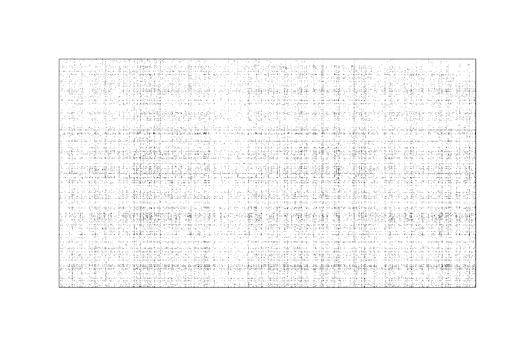
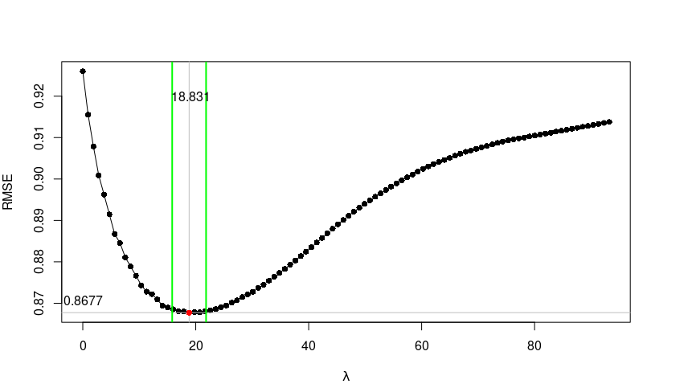
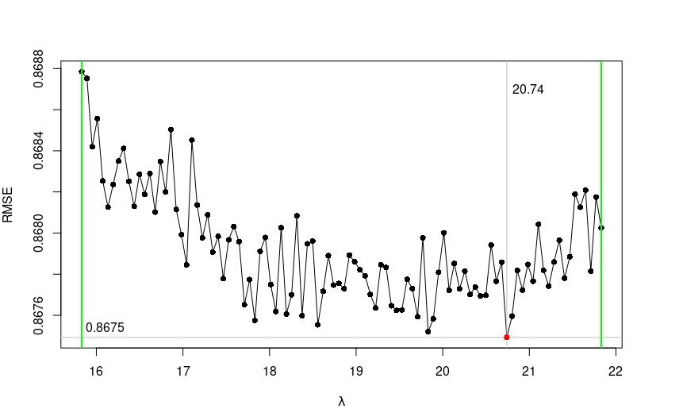
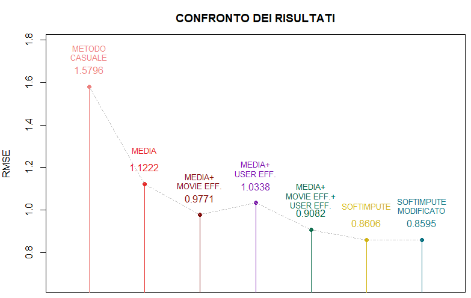

# Progetto di tesi di Philip Salme
Il progetto consiste nel confronto di metodi di imputazione per valori mancanti nel caso di matrici sparse, con un'attenzione particolare all'algoritmo softImpute. Nello specifico, vengono comparati l'imputazione casuale, imputazione basata sulla media e softImpute sul dataset MovieLens-1M. Il metodo basato su softImpute riesce a migliorare, in termini di RMSE, il modello casuale di circa il 45%, riuscendo ad arrivare ad un valore di RMSE pari a 0.861. Questo valore si avvicina al valore ottenuto da altri modelli più recenti (https://paperswithcode.com/sota/collaborative-filtering-on-movielens-1m).

## Dati
I dati possono essere scaricati dal seguente indirizzo.
url-movielens-1m: https://grouplens.org/datasets/movielens/1m/

Di seguito viene riportata la distribuzione dei voti nel dataset.

Un'immagine che rappresenta il dataset in formato matriciale, con i punti neri che rappresentano i rating osservati.

## librerie R necessarie
softimpute, tidyverse, parallel, MASS.

## Risultati in sintesi
λ VS RMSE per softimpute nel validation set:

Di seguito viene riportata un'immagine riassuntiva dei risultati del modello softImpute rispetto al modello casuale e ad un modello di imputazione della media.

